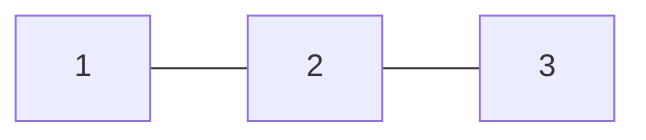
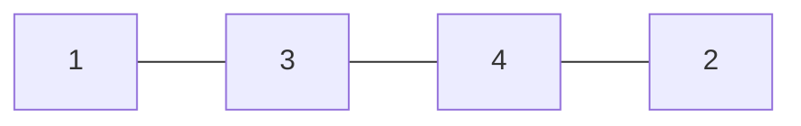
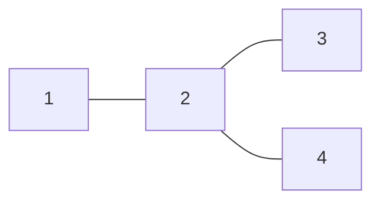
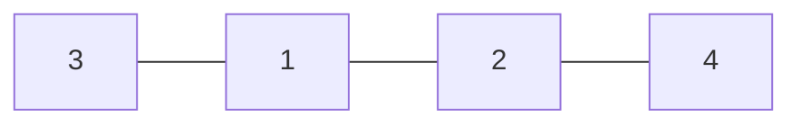

# arc142

## c. [Tree Queries](https://atcoder.jp/contests/arc142/tasks/arc142_c)

假设令$D_{i}$为$1,2$到$i$距离之和,那么对于大部分情况$\min{D_{i}}$即为所求  
当出现$\min{D_{i}} = 3$时,有以下情况  





在询问中记录$D_{i}$的数量,当有两个点满足时再对其两点询问一次,$D_{i,j} = 3|2$时答案为1  
仅一点满足答案也为1  

```cpp
int c1[3],cnt1=0;

int ask(int p){
    int d1,d2;
    printf("? 1 %d\n", p); fflush(stdout);
    scanf("%d", &d1);
    printf("? 2 %d\n", p); fflush(stdout);
    scanf("%d", &d2);
    if(d1+d2 == 3)
        c1[++cnt1] = p;
    return d1+d2;
}

int ask(int c,int d){
    int res;
    printf("? %d %d\n",c,d); fflush(stdout);
    scanf("%d", &res);
    return res;
}

int main(){
    int n;
    scanf("%d",&n);
    int ans = INT32_MAX;
    for(int i=3;i <= n;i++)
        ans = std::min(ans,ask(i));

    if(cnt1 == 1 && ans == 3)
        ans = 1;
    else if(cnt1 == 2 && ans == 3){
        int as = ask(c1[1],c1[2]);
        if(as == 2 || as == 3)
            ans = 1;
        else
            ans = 3;
    }
    printf("! %d\n", ans);fflush(stdout);
    return 0;
}
```

[记录](https://atcoder.jp/contests/arc143/submissions/me?f.Task=&f.LanguageName=&f.Status=&f.User=tx995976)